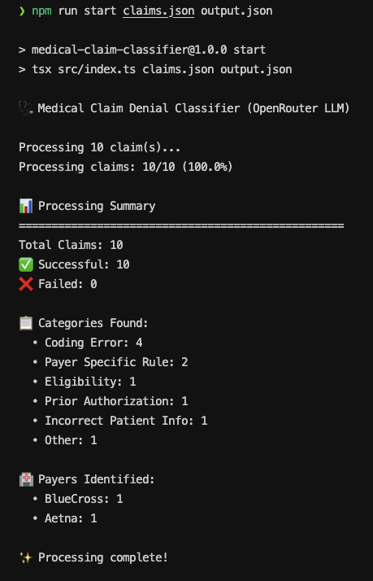
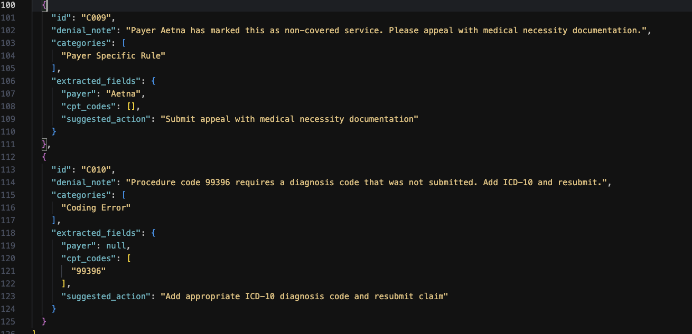

# 🏥 Medical Claim Denial Classifier

An AI-powered tool that automatically classifies medical claim denials and extracts key information using OpenRouter's LLM API.





## 🚀 Quick Start

### 1. Install Dependencies

```bash
npm install
```

### 2. Set Up API Key

Create a `.env` file with your OpenRouter API key:

```bash
echo "OPENROUTER_API_KEY=your_key_here" > .env
```

### 3. Run the Classifier

```bash
npm run start claims.json output.json
```

## 📋 How It Works

The tool reads medical claim denial notes and automatically:

- **Classifies** denials into categories like "Coding Error", "Prior Authorization", etc.
- **Extracts** key information like payer names, CPT codes, and suggested actions
- **Provides** structured JSON output for further processing

## 📁 Input Format

Your input file should be a JSON array of claims:

```json
[
  {
    "id": "C001",
    "denial_note": "Claim denied due to invalid CPT code submitted. Please resubmit with a valid code."
  },
  {
    "id": "C002",
    "denial_note": "Patient was not eligible for coverage on the date of service. Verify insurance status."
  }
]
```

## 📊 Output Format

The tool enriches each claim with classifications and extracted fields:

```json
[
  {
    "id": "C001",
    "denial_note": "Claim denied due to invalid CPT code submitted. Please resubmit with a valid code.",
    "categories": ["Coding Error"],
    "extracted_fields": {
      "payer": null,
      "cpt_codes": [],
      "suggested_action": "Review and resubmit claim with correct CPT code"
    }
  }
]
```

## 🏷️ Classification Categories

The tool automatically categorizes denials into these types:

- **Eligibility** - Patient coverage issues
- **Coding Error** - Incorrect CPT/ICD codes
- **Prior Authorization** - Missing pre-approval
- **Incorrect Patient Info** - Demographic mismatches
- **Payer Specific Rule** - Insurance-specific policies
- **Other** - Miscellaneous issues

## 🛠️ Available Commands

```bash
# Run the classifier
npm run start input.json output.json

# Development mode (with auto-reload)
npm run dev input.json output.json

# Build TypeScript
npm run build
```

## 📈 Example Output

After processing, you'll see a summary like this:

```
📊 Processing Summary
==================================================
Total Claims: 10
✅ Successful: 9
❌ Failed: 1

📋 Categories Found:
  • Coding Error: 4
  • Eligibility: 3
  • Prior Authorization: 2

🏥 Payers Identified:
  • Aetna: 3
  • BlueCross: 2
  • Cigna: 1
```

## 🔧 Requirements

- Node.js 18+
- OpenRouter API key
- TypeScript (for development)

## 🚨 Error Handling

The tool gracefully handles:

- Individual claim failures (continues processing others)
- API rate limiting (500ms delays between requests)
- Network issues (automatic retries)
- Invalid JSON responses

Failed claims are included in output with error messages for debugging.

## 📝 Notes

- Processing includes a 500ms delay between API calls to respect rate limits
- The tool uses Claude 3.5 Sonnet via OpenRouter for high-quality classifications
- All responses are validated to ensure proper JSON structure
- Failed claims are logged but don't stop the overall process
